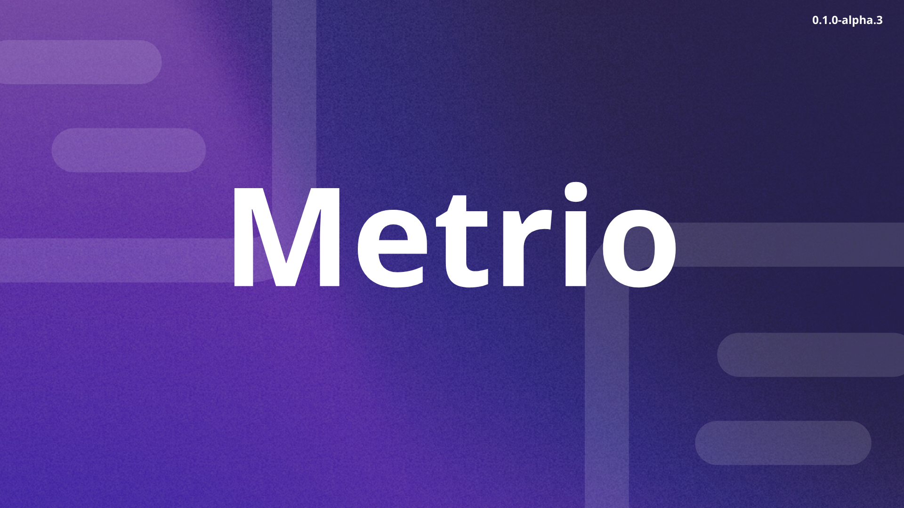

## Visão Geral

O Metrio é uma plataforma de observabilidade completa, projetada especificamente para desenvolvedores, micro SaaS e empresas SaaS que precisam monitorar, analisar e compreender o desempenho de seus sistemas em tempo real. Com uma abordagem centrada no desenvolvedor, o Metrio transforma dados técnicos complexos em insights acionáveis que impulsionam tanto decisões de desenvolvimento quanto de negócios.

Enquanto soluções tradicionais de monitoramento geram dashboards confusos e desconectados, o Metrio oferece uma visão unificada e contextualizada de todos os seus sistemas, APIs e interações de usuários. Nossa plataforma elimina a barreira entre dados técnicos e métricas de negócios, permitindo que equipes técnicas e não técnicas trabalhem com a mesma fonte de verdade.

### Por que o Metrio é essencial para seu negócio SaaS:

- **Visibilidade completa**: Monitore toda sua infraestrutura, backend, frontend e experiência do usuário em uma única plataforma
- **Detecção proativa de problemas**: Identifique anomalias antes que afetem seus clientes
- **Correlação entre métricas técnicas e de negócios**: Entenda como a performance técnica impacta diretamente suas métricas de negócio
- **Implementação sem fricção**: Configure em minutos, não semanas, sem alterar drasticamente sua arquitetura
- **Otimizado para pequenas equipes**: Feito para desenvolvedores que não têm tempo para configurar soluções complexas

### O que torna o Metrio único:

- **Webhooks personalizáveis e sem código**: Monitore eventos importantes sem conhecimento técnico avançado
- **Dashboards modulares**: Visualizações personalizadas para cada necessidade do seu negócio
- **Integrações simplificadas**: Conecte-se a qualquer sistema ou fonte de dados
- **Análises em tempo real**: Tome decisões baseadas nos dados mais recentes
- **IA para insights avançados**: Descubra tendências e padrões automaticamente

## 🚀 Características Principais

- **Dashboard Personalizado**: Interface modular com widgets de métricas arrastar-e-soltar para visualização intuitiva
- **Webhooks em Tempo Real**: Receba e processe notificações instantâneas sobre eventos importantes com monitoramento contínuo
- **Sistema de Notificações**: Alertas em tempo real via WebSockets com sincronização entre múltiplas instâncias do servidor
- **IA & Insights**: Análises avançadas, detecção de padrões e recomendações geradas por inteligência artificial
- **Controle de Acesso**: Gerenciamento de equipes, projetos e permissões com recursos de colaboração
- **Segurança Empresarial**: Proteção de dados com criptografia, autenticação de dois fatores e controles de acesso granulares

## 🔄 Como Funciona a Plataforma

### Configuração Inicial

1. **Criação de Webhooks Personalizados**:

   - Configure webhooks através de interface intuitiva sem necessidade de código complexo
   - Defina facilmente quais eventos monitorar em seu sistema
   - Receba tokens de autenticação e endpoints gerados automaticamente

2. **Integração com o Site/Plataforma do Cliente**:

   - Implemente o código do webhook em seu sistema usando nossa documentação detalhada
   - Monitore eventos como registro de usuários, compras, erros ou qualquer interação importante
   - Capture dados enriquecidos em formato JSON para análise posterior

3. **Coleta e Armazenamento de Métricas**:

   - Receba e processe eventos em tempo real com nossa arquitetura escalável
   - Armazene dados estruturados em banco de dados PostgreSQL otimizado para consultas analíticas
   - Mantenha histórico completo de métricas para análises temporais e comparativas

4. **Análise e Visualização**:
   - Acesse dashboards interativos com visualizações personalizáveis por departamento
   - Monitore métricas-chave com widgets modulares de gráficos, tabelas e indicadores
   - Compartilhe insights entre equipes para uma visão unificada dos dados

### Integração entre Departamentos

- **Data Science**: Análise comportamental e identificação de padrões de uso com relatórios detalhados
- **Marketing**: Acompanhamento de campanhas, ROI e segmentação de clientes baseada em dados
- **Design**: Otimização de interfaces através de testes A/B e métricas de interação
- **Desenvolvimento**: Monitoramento proativo de erros e performance da aplicação

### Núcleo do Sistema

A arquitetura do Metrio é construída sobre três pilares principais:

1. **Webhooks Personalizáveis**: Motor de coleta que captura eventos em tempo real
2. **APIs Robustas**: Backend que processa, armazena e analisa os dados recebidos
3. **Sistema de Notificações em Tempo Real**: Comunica eventos importantes via WebSockets com persistência em banco de dados

Esta estrutura integrada permite que equipes multidisciplinares trabalhem com os mesmos dados, cada uma visualizando as métricas mais relevantes para suas necessidades específicas.

## 🛠️ Tecnologias

- **Framework**: [Next.js 15](https://nextjs.org/)
- **UI & Componentes**: [React 18](https://reactjs.org/), [Radix UI](https://www.radix-ui.com/), [shadcn/ui](https://ui.shadcn.com/)
- **Estilização**: [Tailwind CSS](https://tailwindcss.com/)
- **Banco de Dados**: [PostgreSQL](https://www.postgresql.org/), [Prisma ORM](https://www.prisma.io/)
- **Tempo Real**: [Socket.IO](https://socket.io/) para WebSockets, PostgreSQL LISTEN/NOTIFY
- **Autenticação**: [NextAuth.js](https://next-auth.js.org/)
- **Gerenciamento de Estado**: [Zustand](https://github.com/pmndrs/zustand)
- **Requisições HTTP**: [Axios](https://axios-http.com/)
- **Parâmetros de URL**: [nuqs](https://github.com/47ng/nuqs)
- **Tabelas e Virtualização**: [TanStack Table/Virtual](https://tanstack.com/table)
- **Gráficos e Visualizações**: [Recharts](https://recharts.org/)
- **Formulários**: [React Hook Form](https://react-hook-form.com/), [Zod](https://github.com/colinhacks/zod)
- **Componentes de Data**: [react-day-picker](https://react-day-picker.js.org/)

## 📁 Estrutura do Projeto

```
Metrio/
├── app/                       # Diretórios de rotas do Next.js
│   ├── dashboard/             # Dashboard principal
│   │   ├── apis/              # Configuração de APIs
│   │   ├── webhooks/          # Gerenciamento de webhooks
│   │   ├── ai-insights/       # Análises de IA
│   │   ├── security/          # Configurações de segurança
│   │   ├── settings/          # Configurações gerais
│   │   ├── documentation/     # Documentação para usuários
│   │   ├── teams/             # Gerenciamento de equipes
│   │   └── projects/          # Gerenciamento de projetos
│   ├── docs/                  # Documentação técnica e tutoriais
│   │   └── notifications/     # Documentação sobre notificações
│   ├── login/                 # Autenticação
│   ├── register/              # Registro de usuários
│   └── api/                   # Endpoints da API
│       ├── auth/              # Autenticação API
│       ├── webhooks/          # Endpoints de webhooks
│       └── docs/              # Documentação da API (Swagger)
├── components/                # Componentes reutilizáveis
│   ├── ui/                    # Componentes de UI base
│   ├── dashboard/             # Componentes do dashboard
│   ├── webhooks/              # Componentes para webhooks
│   └── auth/                  # Componentes de autenticação
├── lib/                       # Utilitários e helpers
│   └── providers/             # Context providers
├── prisma/                    # ORM e schema do banco de dados
│   └── schema.prisma          # Modelo do banco de dados
└── public/                    # Arquivos estáticos
```

## 📊 Casos de Uso

- **Empresas SaaS**: Monitoramento de métricas de crescimento, churn, MRR, LTV e engajamento de usuários
- **E-commerce**: Análise de conversão, comportamento de compra, carrinho abandonado e performance de produtos
- **Marketing Digital**: Acompanhamento de campanhas, ROI, tráfego e engajamento nas redes sociais
- **Aplicativos Móveis**: Métricas de uso, retenção, tempo de sessão e comportamento do usuário
- **Desenvolvimento de Software**: Monitoramento de erros, performance, deploy e métricas de qualidade

## Sistema de Autenticação

O Metrio utiliza NextAuth.js para autenticação segura de usuários com banco de dados PostgreSQL e Prisma como ORM.

### Funcionalidades Implementadas

- Registro de usuários com validação de dados usando Zod
- Autenticação com email e senha
- Proteção de rotas privadas
- Contas de usuário com papéis e permissões
- Documentação da API com Swagger

## 🔒 Segurança e Privacidade

- Criptografia de ponta a ponta
- Autenticação de dois fatores
- Conformidade com LGPD/GDPR
- Controles de acesso granulares
- Tokens de autenticação seguros para webhooks
- Auditorias de segurança regulares

## 🚀 Implantação

O projeto está configurado para fácil implantação em:

- [Vercel](https://vercel.com)
- [Netlify](https://netlify.com)
- [AWS](https://aws.amazon.com)
- [Google Cloud](https://cloud.google.com)

## 🎁 Versão Gratuita

- 14 dias de teste gratuito
- Sem necessidade de cartão de crédito
- Acesso a recursos básicos
- Suporte via documentação

## 👥 Equipe e Contribuições

Metrio é desenvolvido por uma equipe dedicada de especialistas em dados, UX e engenharia. Contribuições são bem-vindas através de pull requests.

## 📄 Licença

Copyright © 2024 Metrio. Todos os direitos reservados.
